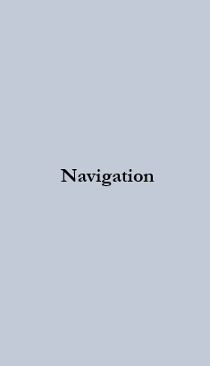

# Sean Brylle Delos Santos Portfolio Project Documentation
This project is a documentation for the portfolio project website. It will outline the components of the website 
and details the font, and colors used within. The documentation also includes some screenshots of the mockups.

## **Header**

- **Font Style:** `Garamond`
- **Font Color:** `rgb(255, 255, 255)`
- **Background:** An image of a sea
- **Layout:** Centered located on top of the website
- **Mock-up Screenshot:**

## **Navigation Panel**
- **Font Style:** `Garamond`
- **Font color:** `rgb(0, 0, 0)`
- **Background Color:** `rgba(163, 174, 193, 0.406)`
- **Design:** Flexbox located in the middle towards the left
- **Mock-up Screenshot:**

## **Body**
- **Description:** Shows the preview of the labs
- **Font Style:** `Helvetica`
- **Font color:** `rgb(0, 0, 0)`
- **Background Color:** `rgb(255, 255, 255)`
- **Mock-up Screenshot:**

## **Footer**
- **Font Style:** `Garamond`
- **Font color:** `rgb(255, 255, 255)`
- **Background Color:** `rgb(78, 83, 98)`
- **Design:** Flexbox located in the bottom center
- **Mock-up Screenshot:**

